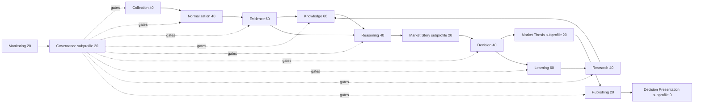

# Capability Dependency Graph

A capability cannot be promoted above a required upstream dependency unless it proves a fail-closed
isolation contract. Cyclic learning (`Decision -> Learning -> Research -> Knowledge`) is
non-production and cannot mutate the live decision path.
